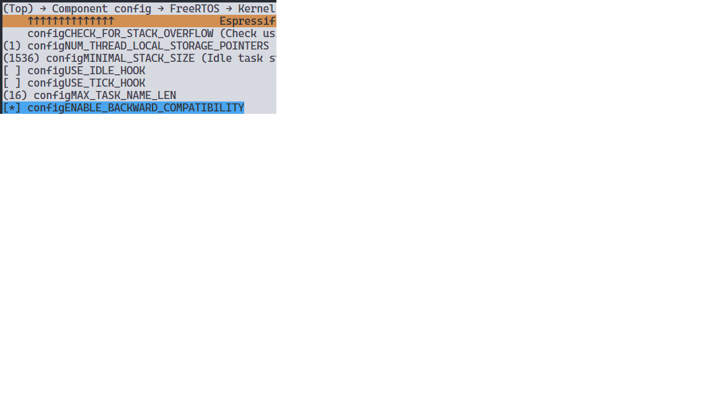
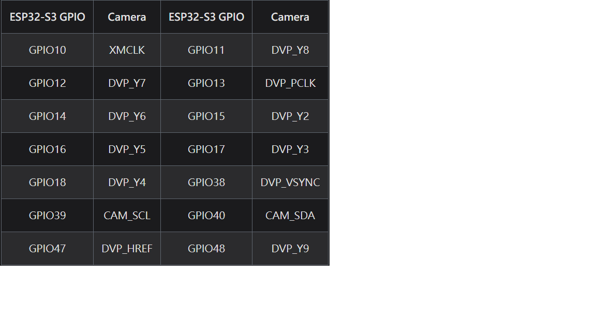

# XIAO Camera Project

## Clone this project

```bash
git clone --recurse-submodules <url>

# if you already clone, do the following
git submodule update --init --recursive
```

## Dependencies (in `src/idf-component.yml`)

- [esp32_camera](https://registry.platformio.org/libraries/espressif/esp32-camera)
- [esp_rtsp](https://github.com/espressif/esp-adf/tree/master/examples/protocols/esp-rtsp)
- [esp_h264(opt)](https://components.espressif.com/components/espressif/esp_h264)

要先對 platformio.ini 作一些更改(加一個符號儲存->刪掉->儲存)，讓 platformio 更新

- 針對 esp_rtsp, 其是 esp-adf 的一員，因此需要進行安裝,[步驟如下](https://docs.espressif.com/projects/esp-adf/en/latest/get-started/index.html#windows)

  - [ref](https://community.platformio.org/t/esp32-adf-audio-dev-framework-please-help/5235/52)
  - `CONFIG_FREERTOS_ENABLE_BACKWARD_COMPATIBILITY=y`
    

  ```cmd
  # 使用 cmd 而非 powershell (因為 esp-adf 尚未提供 .ps1 版本的 export)
  cd ..
  git clone --recursive https://github.com/espressif/esp-adf.git
  cd esp-adf
  ./install.bat
  ./export.bat
  ```

- add submodule to specific directory

  ```bash
  git submodule add https://github.com/espressif/esp-adf.git third_party/esp-adf
  git submodule update --init --recursive
  ```

## Pinout



## PSRAM

- `-D BOARD_HAS_PSRAM` should be defined in field `build_flags` in `platformio.ini`

## Problem Shooting

1. **grabRef.cmake problem**

   - disable cmake plugin
   - add first git commit
   - check there's no .git before .platformio directory

   ```bash
     CMake Error at .pio/build/<...>/CMakeFiles/git-data/grabRef.cmake:48 (file):
     file failed to open for reading (No such file or directory):
   ```

2. Unknown keys: repository_info

   component 版本太新，需要更新 platformio 的工具鍊

   ```bash
   # 開啟 PlatformIO CLI
   pio pkg update
   ```

   不行請刪除 USER/.platformio

fatal: not a git repository (or any of the parent directories): .git
CMake Error at C:/Users/USER/.platformio/packages/framework-espidf@3.50102.240122/tools/cmake/component.cmake:250 (message):
ERROR: 2 problems were found in the manifest file
C:\Dennis\Develop\Firmware\NTHU\IandC\cam\XIAO\espidf_video_rtsp\managed_components\espressif\_\_esp32-camera\idf_component.yml:

C:\Users\USER\.platformio\penv\.espidf-5.1.2\Scripts\python.exe -m pip install --upgrade idf-component-manager

3. [internal compiler error: Segmentation fault in esp_lcd_panel_rgb.c](https://github.com/espressif/esp-idf/issues/12180)

- do full clean to remove built directory then build again
- [remove broken component](https://github.com/manuelbl/ttn-esp32/issues/76#issuecomment-2094825192)

## 客製板

ESP-ADF 允許客製板，只是客製板需要一些步驟

- 先將 AUDIO_HAL->AUDIO_BOARD 選成客製
- 回到主畫面 -> CUSTOM_ESP_ADF_BOARD -> XIAO_ESP32_S3_SENSE

## TODO

- clang-format problem